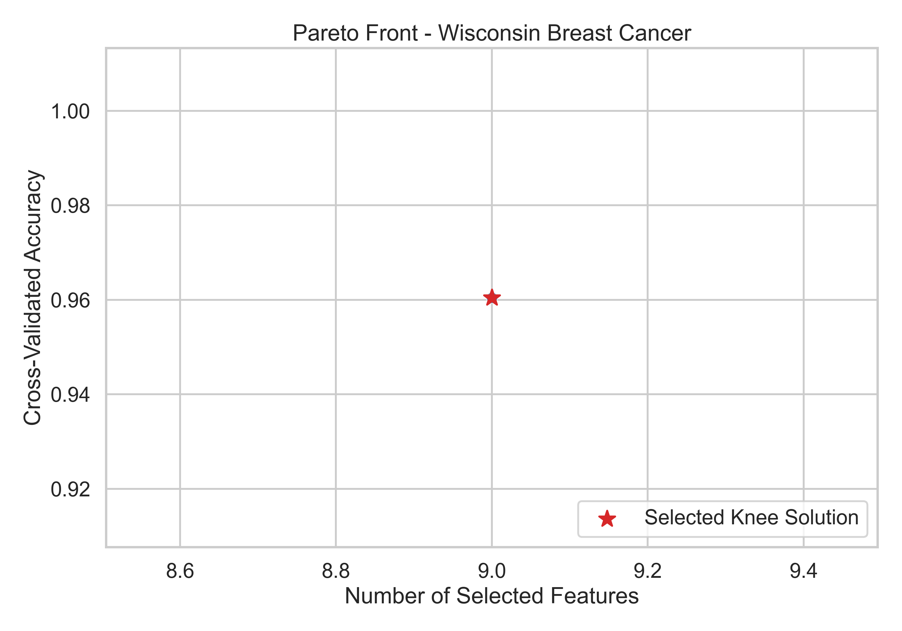
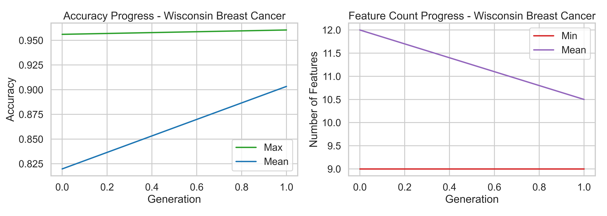
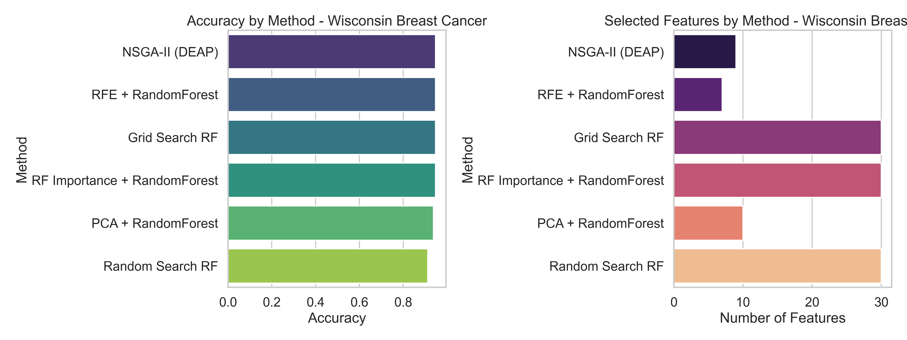
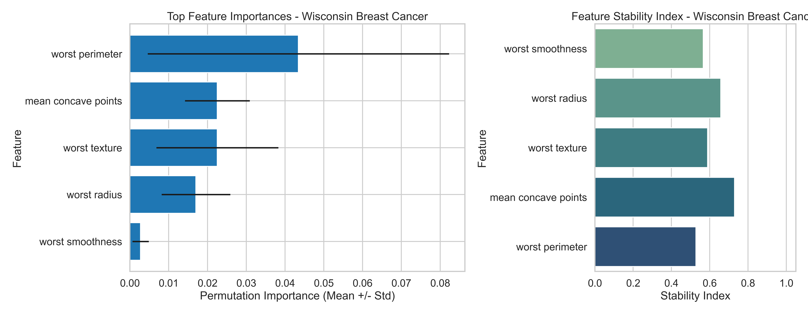
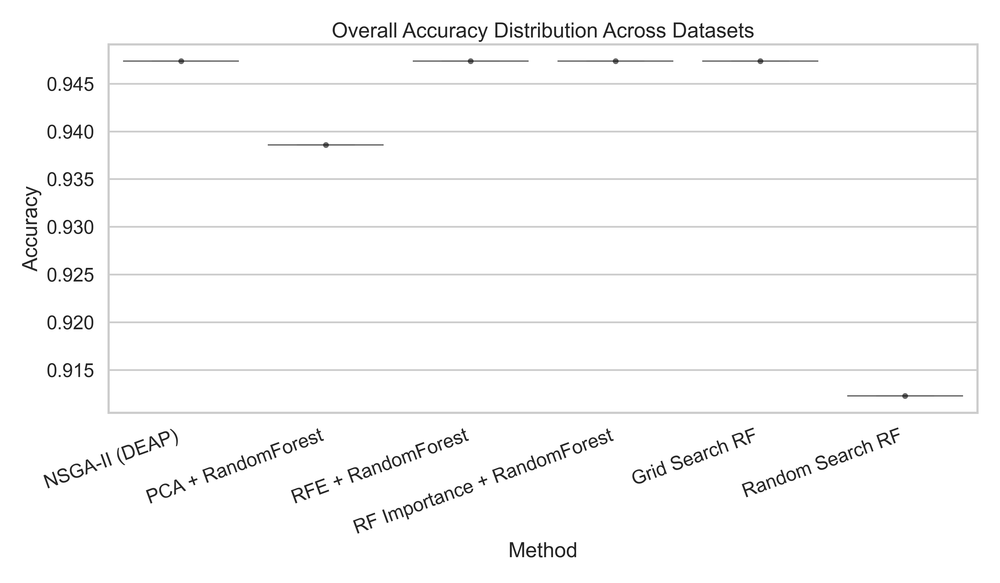

# Multi-Objective Evolutionary Feature Selection (MOEFS)

Joint optimization of feature selection and classifier hyperparameters for medical tabular datasets using NSGA-II (DEAP).

GitHub: [Project Repository](https://github.com/royxlead/multi-objective-evolutionary-feature-selection-python.git)

## What This Project Does

The optimization targets two objectives at the same time:

1. Maximize classification performance
2. Minimize number of selected features

It evolves:

- Binary feature masks
- Classifier family (RandomForest, SVM, optional XGBoost)
- Classifier-specific hyperparameters

It also evaluates required baselines and exports reproducible artifacts (CSV, plots, logs, metadata).

## Key Features

- NSGA-II Pareto optimization with knee-point style model selection support
- Leakage-safe preprocessing (train-only fitting for imputation and optional feature expansion)
- Baselines included:
  - PCA + RandomForest
  - RFE + RandomForest
  - RF Importance + RandomForest
  - Grid Search RF
  - Random Search RF
- Statistical testing:
  - Paired t-test
  - Wilcoxon signed-rank test
  - Holm-Bonferroni correction
  - Effect sizes and confidence intervals
- Interpretability outputs with permutation importance stability
- Reproducibility metadata (runtime, environment, package versions, config snapshot)

## Datasets

- Wisconsin Breast Cancer (scikit-learn built-in)
- Pima Indians Diabetes (downloaded and cached on demand)
- Heart Disease Cleveland (downloaded and cached on demand)

Note:

- The data directory is created only when a run actually needs downloadable datasets.
- If you run with dataset-limit 1, only Wisconsin is used and no download cache is required.

## Repository Layout

```text
.
├── plots/
├── results/
├── src/moefs/
├── tests/
├── project_demo.ipynb
├── requirements.txt
└── run_experiment.py
```

## Requirements

- Python 3.10+
- See requirements.txt for pinned minimum package versions

## Installation

```bash
python -m venv .venv

# Windows
.venv\Scripts\activate

# macOS/Linux
source .venv/bin/activate

pip install -r requirements.txt
```

Optional:

```bash
pip install xgboost
```

## Run

Default run:

```bash
python run_experiment.py
```

Quick smoke run:

```bash
python run_experiment.py --quick
```

Single-dataset run (fast, useful for demos/CI):

```bash
python run_experiment.py --dataset-limit 1 --quick
```

Minimal proof-style run used in this workspace:

```bash
python run_experiment.py --dataset-limit 1 --population-size 4 --generations 1 --seed 42 --disable-feature-expansion
```

## Main CLI Options

- --population-size INT
- --generations INT
- --seed INT
- --dataset-limit INT
- --quick
- --disable-feature-expansion
- --enable-xgboost

## Sample Input and Output

Sample input command:

```bash
python run_experiment.py --dataset-limit 1 --population-size 4 --generations 1 --seed 42 --disable-feature-expansion
```

Sample console output excerpt:

```text
INFO | Processing dataset: Wisconsin Breast Cancer
INFO | [Wisconsin Breast Cancer] Gen 1 | acc_max=0.9605 acc_mean=0.9033 feat_min=9
INFO | Running baseline: PCA + RandomForest
INFO | Running baseline: RFE + RandomForest
INFO | Running baseline: RF importance + RandomForest
INFO | Running baseline: Grid Search RF
INFO | Running baseline: Random Search RF
INFO | Experiment completed successfully.
```

Sample output table (results/final_comparison_table.csv):

```csv
dataset,Grid Search RF,NSGA-II (DEAP),PCA + RandomForest,RF Importance + RandomForest,RFE + RandomForest,Random Search RF
Wisconsin Breast Cancer,0.9473684210526315,0.9473684210526315,0.9385964912280702,0.9473684210526315,0.9473684210526315,0.9122807017543859
```

Sample method summary (results/summary_by_method.csv):

```csv
method,accuracy,precision,recall,f1_score,n_features
Grid Search RF,0.9473684210526315,0.9583333333333334,0.9583333333333334,0.9583333333333334,30.0
NSGA-II (DEAP),0.9473684210526315,0.9714285714285714,0.9444444444444444,0.9577464788732394,9.0
```

## Outputs

After each run, artifacts are written to:

- results/
- plots/

Common result files:

- results/experiment.log
- results/experiment_metadata.json
- results/all_results.csv
- results/summary_by_method.csv
- results/final_comparison_table.csv
- results/significance_tests.csv

Common plot files:

- plots/*_pareto_front.png
- plots/*_evolution_history.png
- plots/*_method_comparison.png
- plots/*_nsga_feature_stability.png
- plots/overall_accuracy_boxplot.png

## Sample Plots

Pareto Front:



Evolution History:



Method Comparison:



Feature Stability:



Overall Accuracy Boxplot:



## Suggested GitHub Proof Bundle (Minimal)

If you want to upload concise proof of work, keep only:

1. results/experiment.log
2. results/experiment_metadata.json
3. results/final_comparison_table.csv
4. results/summary_by_method.csv

Optional add-on:

- one representative plot, e.g. plots/wisconsin_breast_cancer_pareto_front.png

## Testing

```bash
pytest
```

Tests cover core pipeline behavior including dataset loading, baselines, evaluation, and evolutionary operators.

## Notebook Demo

Use project_demo.ipynb for an interactive walkthrough.

## Notes for Stronger Results

- Increase population size and generations
- Run multiple seeds and aggregate statistics
- Enable XGBoost if available
- Report confidence intervals across repeated runs
